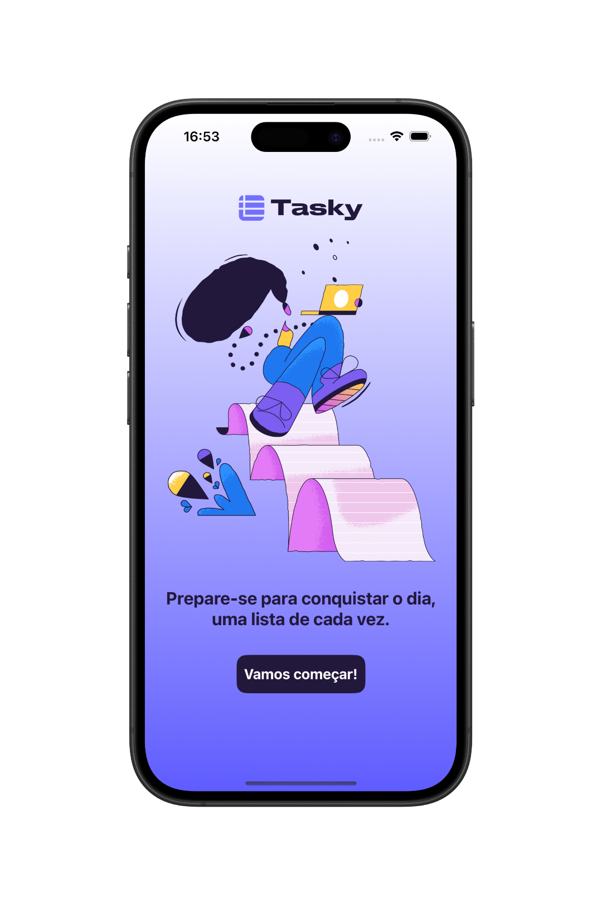
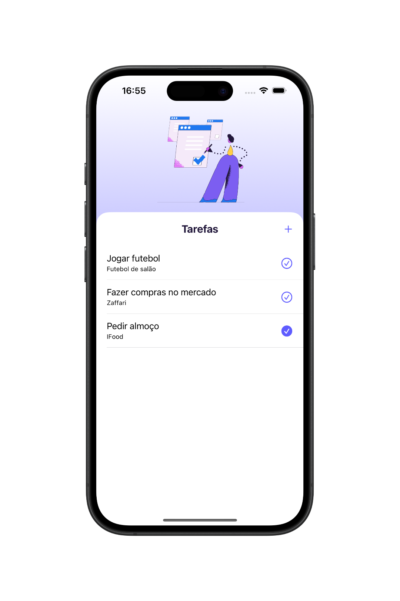
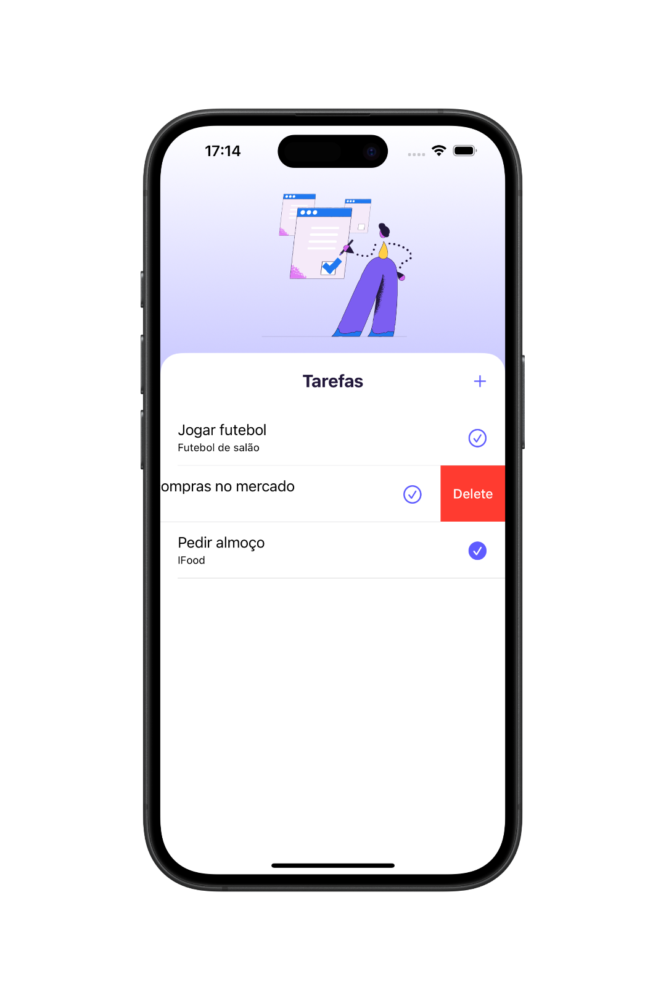
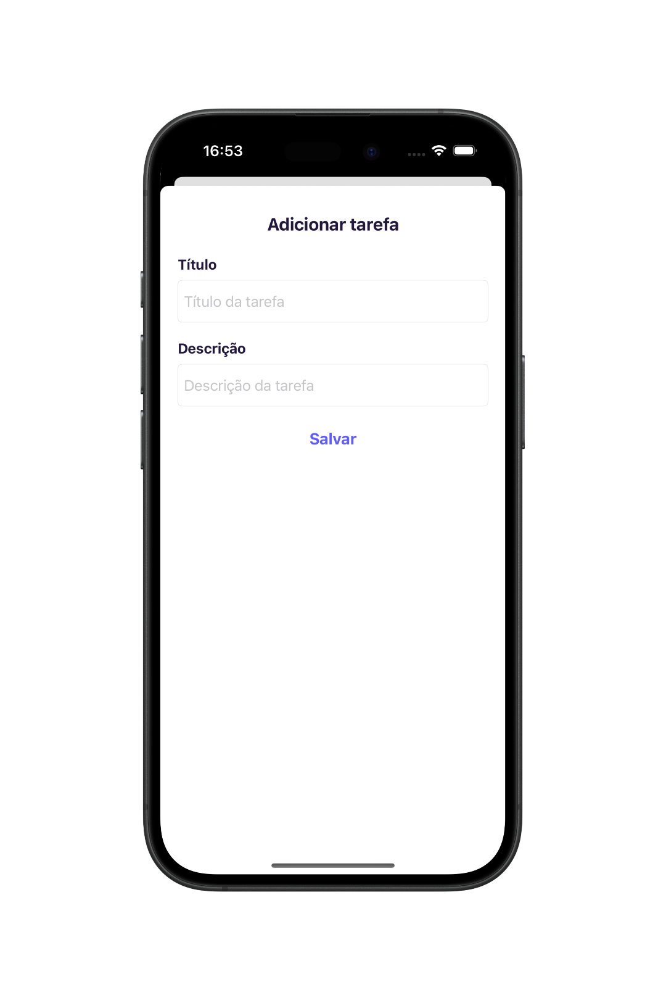

# 📱 Tasky - App de Tarefas

O **Tasky** é um aplicativo iOS desenvolvido com **UIKit (ViewCode)** que ajuda os usuários a visualizarem as suas tarefas do dia a dia. Com uma interface intuitiva e design leve, o app permite adicionar, visualizar, remover e marcar tarefas como concluídas.

  
  
  
  

## 🛠 Tecnologias Utilizadas

- Swift  
- UIKit
- ViewCode 
- Auto Layout (NSLayoutConstraint)
- UITableView
- Armazenamento Local (UserDefaults)
- MVC (Model-View-Controller) 

## 👨🏻‍💻 Como Usar o Aplicativo

- Baixe o projeto e abra com o Xcode.
- Execute o aplicativo em um simulador iOS ou iPhone físico.
- Na tela inicial, toque em **Vamos começar!**.
- Toque no botão **“+”** para acessar a tela de adicionar tarefas.
- Insira ao menos o título da tarefa e toque em **Salvar**. 
- Visualize suas tarefas na lista e toque no ícone à direita da célula para marcá-la como concluída.
- Para remover uma tarefa, deslize a célula para a esquerda.

## 📌 Observação

Este projeto foi desenvolvido com fins educacionais como prática de desenvolvimento iOS utilizando **UIKit** com **ViewCode**, persistência com **UserDefaults**, arquitetura **MVC** e boas práticas de separação de responsabilidades.
